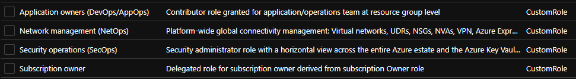

# Module: Custom Role Definitions v1.0
This module defines custom roles based on the recommendations from the Azure Landing Zone Conceptual Architecture. The role definitions are defined in [Identity and access management](https://docs.microsoft.com/azure/cloud-adoption-framework/ready/enterprise-scale/identity-and-access-management) recommendations.

Creates the custom roles seen in the picture below. Left is to figure out how they map to the organization and if they are to be used.


## Update module image

```powershell
Publish-AzBicepModule `
-FilePath infra-as-code/bicep/modules/customRoleDefinitions/customRoleDefinitions.bicep `
-Target br:ccdregistryprod.azurecr.io/bicep/modules/azurefoundation/customroledefinitions:v1.0
```

## Parameters

The module requires the following inputs:

 | Parameter                           | Description                                                                                                                                                                                                                                                    | Requirement     | Example |
 | ----------------------------------- | -------------------------------------------------------------------------------------------------------------------------------------------------------------------------------------------------------------------------------------------------------------- | --------------- | ------- |
 | parAssignableScopeManagementGroupId | The management group scope to which the role can be assigned.  This management group ID will be used for the [assignableScopes](https://docs.microsoft.com/azure/role-based-access-control/role-definitions#assignablescopes) property in the role definition. | Mandatory input | `alz`   |

 ## Deployment

In this example, the custom roles will be deployed to the `estosv` management group (the intermediate root management group).

> For the examples below we assume you have downloaded or cloned the Git repo as-is and are in the root of the repository as your selected directory in your terminal of choice.

### PowerShell

```powershell
$location = 'westeurope'
$managementGroupId = 'estosv'

New-AzManagementGroupDeployment `
  -TemplateFile deploy\modules\customRoleDefinitions\customRoleDefinitions.bicep `
  -Location $location `
  -ManagementGroupId $managementGroupId `
  -WhatIf
```

# Module: Custom Role Definitions v1.1
Append update information.