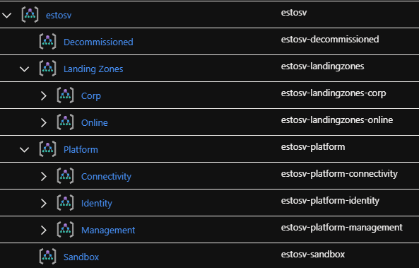

# Module: Management Groups v1.1
Module for deploying a management group hierarchy under root management group. 

* Tenant Root Group
 * Top Level Management Group (defined by parameter parTopLevelManagementGroupPrefix)
   * Platform
     * Management
     * Connectivity
     * Identity
   * Landing Zones
     * Corp
     * Online
   * Sandbox
   * Decommissioned



## Update module image

```powershell
Publish-AzBicepModule `
-FilePath C:\Users\tomsve\Git\cygate-AzPlatform-Core\infra-as-code\bicep\modules\managementGroups\managementGroups.bicep `
-Target br:ccdregistryprod.azurecr.io/bicep/modules/azurefoundation/managementgroups:v1.1
```

## Parameters

The module requires the following inputs:

| Parameter                             | Type   | Description                                                                                                                                                     | Requirements                      | Example               |
| ------------------------------------- | ------ | --------------------------------------------------------------------------------------------------------------------------------------------------------------- | --------------------------------- | --------------------- |
| parTopLevelManagementGroupPrefix      | string | Prefix for the management group hierarchy.  This management group will be created as part of the deployment.                                                    | 2-10 characters                   | `alz`                 |
| parTopLevelManagementGroupDisplayName | string | Display name for top level management group.  This name will be applied to the management group prefix defined in `parTopLevelManagementGroupPrefix` parameter. | Minimum two characters            | `Azure Landing Zones` |

## Deployment

In this example, the management groups are created at the `Tenant Root Group` through a tenant-scoped deployment.

> For the examples below we assume you have downloaded or cloned the Git repo as-is and are in the root of the repository as your selected directory in your terminal of choice.

### PowerShell

```powershell
$location = 'westeurope'

New-AzTenantDeployment `
  -TemplateFile deploy\modules\managementGroups\managementGroups.bicep.bicep `
  -Location $location `
  -WhatIf
```

# Module: Management Groups v1.2
Append update information.